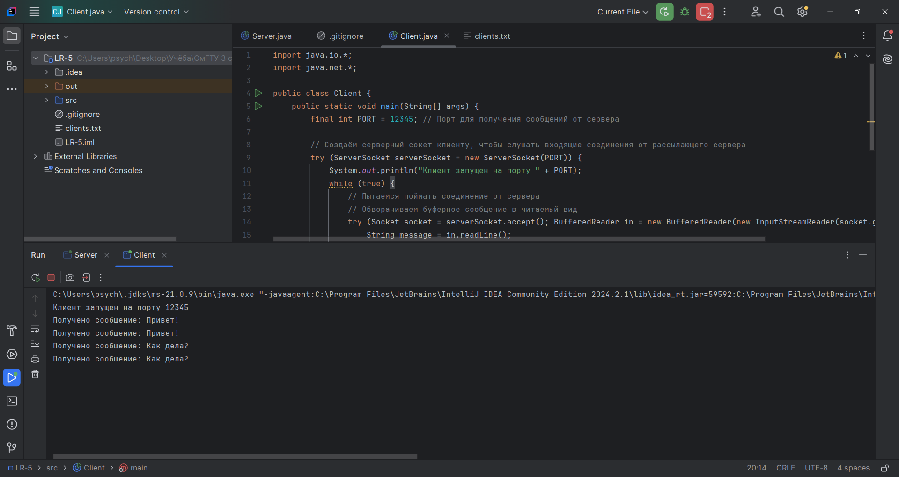

# Лабораторная работа №5
По дисциплине "Объектно-ориентированное программирование", 3 семестр.

Выполнила студентка группы ПИН-232 Корноухова Маргарита.

**Вариант 5.** Сервер рассылает сообщения выбранным из списка клиентам. Список хранится в файле.

